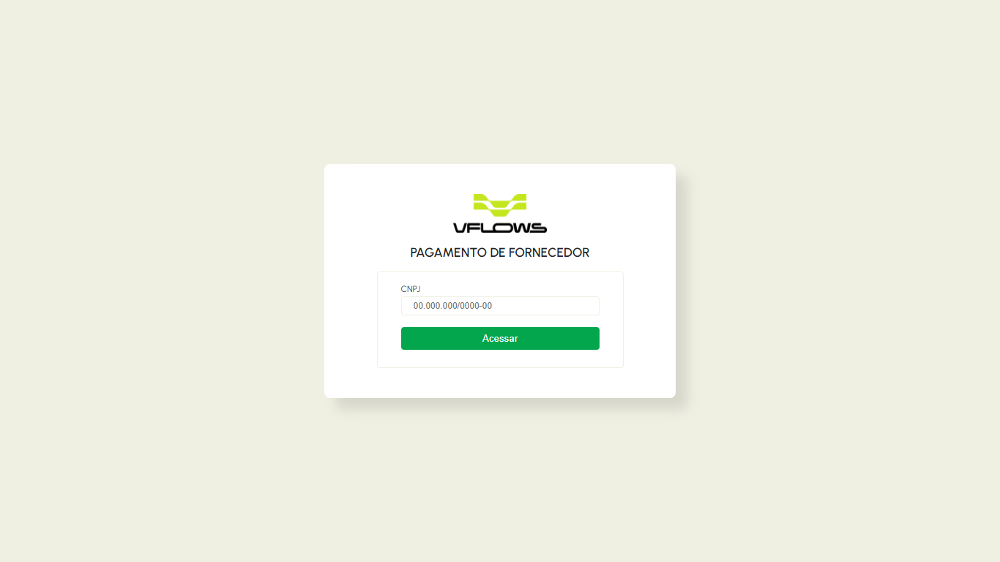
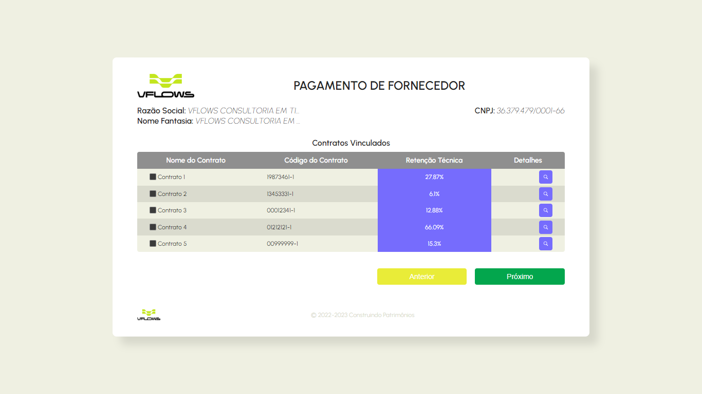
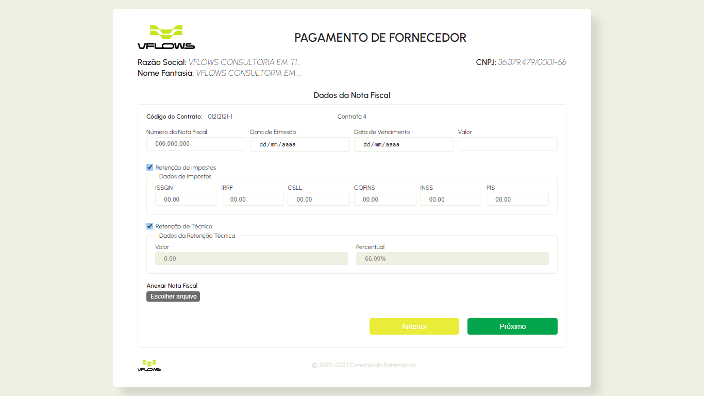
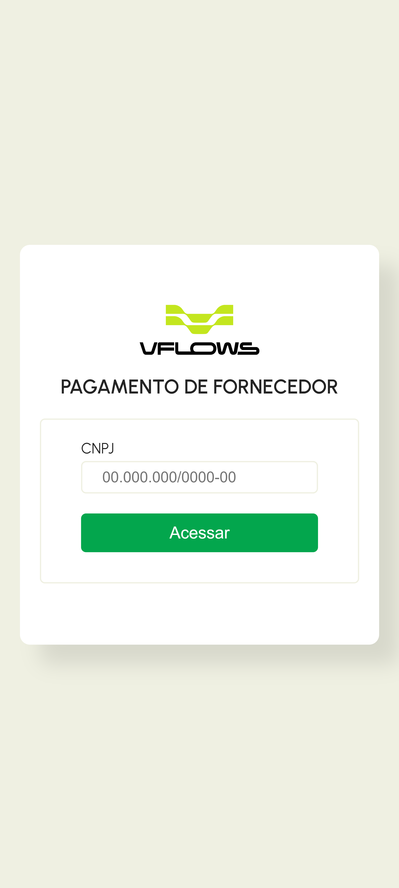
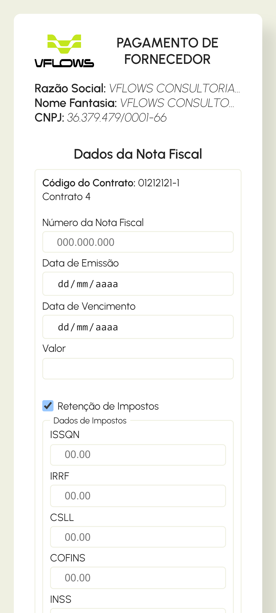

<h1 align="center">
    
</h1>
<p align="center">
    
    
    <a href="https://github.com/NyctibiusVII/SupplierPayment/blob/main/LICENSE">
        
    </a>
</p>
<p align="center">
    <a href="#SupplierPayment-">Projeto</a>&nbsp;&nbsp;&nbsp;|&nbsp;&nbsp;&nbsp;
    <a href="#tecnologias-">Tecnologias</a>&nbsp;&nbsp;&nbsp;|&nbsp;&nbsp;&nbsp;
    <a href="#layout-">Layout</a>&nbsp;&nbsp;&nbsp;|&nbsp;&nbsp;&nbsp;
    <a href="#licença-%EF%B8%8F">Licença</a>
</p>

# SupplierPayment 
Projeto desenvolvido para o gerenciamento de pagamentos de contratos. Projeto realizado para um desafio técnico da @VFlows.

#### Funcionalidades
* Valida cnpj via api do <a href="https://brasilapi.com.br">BrasilApi</a>
* <a href="https://unform-rocketseat.vercel.app">Unform</a> para criação de formulários
* Backend próprio - Api
* Site responsivo - Mobile First

<a href="/briefing.md">Briefing</a> do projeto

<br>

## Tecnologias 🚀
Esse projeto foi desenvolvido com as seguintes tecnologias:
- [ReactJS](https://pt-br.reactjs.org)
- [Typescript](https://www.typescriptlang.org)
- [Vite](https://vitejs.dev)
- [Sass](https://sass-lang.com)
- [NodeJS](https://nodejs.org)
- [Express](https://expressjs.com)

## Layout 🚧
### Desktop Screenshot
<div style="display: flex; flex-direction: 'column'; align-items: 'center';">
<!-- Responsive, 1366 x 768, 50% (Laptop L - 1366px) -->
    
    
    
</div>

### Mobile Screenshot
<div style="display: flex; flex-direction: 'row';">
<!-- Responsive, 320 x 711, 75% (Mobile X11T - 320px) -->
    
    
    
</div>

## Rodando o projeto 🚴🏻‍♂️
#### Na sua maquina:
<details>
    <summary>Dependências</summary>

```json
  ------- WEB -------
  "dependencies": {
    "@unform/core": "^2.1.6",
    "@unform/web": "^2.1.6",
    "axios": "^1.2.5",
    "react": "^18.2.0",
    "react-dom": "^18.2.0",
    "react-router-dom": "^6.8.0",
    "sass": "^1.57.1"
  },
  "devDependencies": {
    "@types/react": "^18.0.26",
    "@types/react-dom": "^18.0.9",
    "@types/react-router-dom": "^5.3.3",
    "@vitejs/plugin-react": "^3.0.0",
    "typescript": "^4.9.3",
    "vite": "^4.0.0"
  }

  ------- NODE -------
  "dependencies": {
    "cors": "^2.8.5",
    "express": "^4.18.2",
    "ts-node": "^10.9.1"
  },
  "devDependencies": {
    "@types/cors": "^2.8.13",
    "@types/express": "^4.17.16",
    "@types/node": "^18.11.18",
    "nodemon": "^2.0.20",
    "typescript": "^4.9.4"
  }
```
> Ex: `$ npm install _____` ou `$ yarn add _____` para instalar as dependências

> Utilize a tag `-D` para instalar as dependências de desenvolvimento.<br>
> Utilize a tag `@types` para instalar o suporte a Typescript.<br>
> Utilize a tag `@latest` para instalar a versão mais recente.
</details>

```bash
# Clone o repositório
$ git clone https://github.com/NyctibiusVII/SupplierPayment.git

# Acesse a pasta do projeto no terminal
$ cd SupplierPayment

# Acesse a pasta do sub-projeto no terminal:
$ cd SupplierPayment             # Projeto ReactJS
$ cd server                      # Projeto NodeJS

# Instale as dependências com o gerenciador de pacotes de sua preferência
$ npm install   /   yarn add     # Serve para ReactJS e NodeJS

# Execute o sub-projeto:
# ---------- PARA WEB ---------- #
$ npm run dev   /   yarn dev     # Para rodar o projeto Web (Frontend)

# --------- PARA NODE ---------- #
$ npm run dev   /   yarn dev     # Para rodar o projeto Node (Backend)

# O Frontend roda na porta: 3000
# O Backend roda na porta: 3333

# Acesse http://localhost:$PORT *Ex: Cuidado para não ligar dois ou mais projetos na mesma porta, pois o servidor pode não iniciar.
```

## Licença ⚖️
Este projeto está sob a licença do MIT. Veja o arquivo [LICENSE](https://github.com/NyctibiusVII/SupplierPayment/blob/main/LICENSE) para mais detalhes.

## Contato ✉️
| [](https://github.com/NyctibiusVII) |
| :---: |
| <sub>[Matheus Vidigal](https://github.com/NyctibiusVII)</sub> |

<p align="left">
    <a href="https://www.linkedin.com/in/matheus-vidigal-nyctibiusvii/">
        
    </a>
    <a href="https://mail.google.com/mail/u/1/#inbox?compose=GTvVlcSGLCKpKJfwPsKKqzXBplKkGtCLvCQcFWdWxCxQFfkHzzjVkgzrMFPBgKBmWFHvrjrCsMqSH">
        
    </a>
</p>